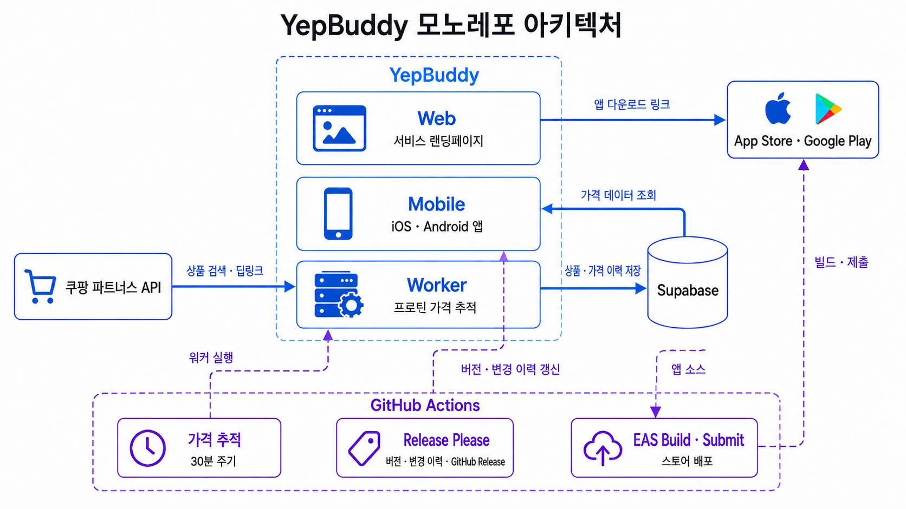

# YepBuddy

YepBuddy는 운동 기록과 프로틴 가격 추적을 제공하는 Expo/React Native 기반 iOS·Android 피트니스 앱입니다.

하나의 제품을 구성하는 모바일 앱, 서비스 랜딩페이지, 가격 추적 워커와 배포 자동화를 모노레포에서 함께 관리합니다.

[서비스 바로가기](https://yepbuddy.netlify.app/)

## 전체 아키텍처

---

## 개발 및 배포 구성

### iOS·Android 앱 스토어 배포

개인 프로젝트는 배포 간격이 일정하지 않아, 배포할 때마다 iOS와 Android의 서로 다른 명령어와 옵션을 다시 확인해야 했습니다. 이 과정의 실수를 줄이고 동일한 절차를 반복해서 사용할 수 있도록 스토어 배포를 GitHub Actions로 자동화했습니다.

플랫폼과 제출 여부만 선택하면 빌드부터 스토어 제출까지 실행되며, 배포 명령어를 따로 기억하거나 관리할 필요가 없어졌습니다. 안전한 배포를 위해 `main` 브랜치와 메인테이너 계정에서만 실행되도록 제한했습니다.

### 릴리스 관리

Release Please가 Conventional Commits를 기준으로 앱 버전과 `CHANGELOG`를 갱신하고 릴리스 PR을 생성합니다. 이때 iOS `buildNumber`와 Android `versionCode`도 앱 버전에 맞춰 자동으로 반영합니다.

릴리스 PR이 병합되면 태그와 GitHub Release를 생성합니다. 플랫폼별 버전을 직접 수정하는 반복 작업을 없애고, 빌드 번호 중복으로 스토어 제출이 실패하는 위험을 줄였습니다.

### 모노레포를 선택한 이유

개인 프로젝트에서 모바일·웹·워커를 별도 저장소로 운영하면 PR, 설정, 자동화 워크플로 등 관리해야 할 지점이 늘어납니다. 특히 프로틴 가격 기능은 워커의 수집부터 Supabase 저장, 모바일 앱의 조회까지 하나의 흐름으로 연결됩니다.

관리 지점을 줄이기 위해 세 프로젝트와 가격 수집·릴리스·스토어 배포 워크플로를 하나의 모노레포에서 관리합니다. 제품 단위의 변경을 한곳에서 검토하면서도 각 프로젝트의 빌드와 실행 구조는 독립적으로 유지했습니다.

---

## 핵심 구현

### Mobile

- [상태 관리와 스냅샷 복구를 통한 운동 기록 유실 방지](mobile/README.md#1-상태-관리와-스냅샷-복구를-통한-운동-기록-유실-방지)
- [플랫폼별 디자인을 공통 컴포넌트로 통합한 iOS·Android UI 구축](mobile/README.md#2-플랫폼별-디자인을-공통-컴포넌트로-통합한-iosandroid-ui-구축)
- [React Native와 HealthKit을 연결한 양방향 브릿지 구축](mobile/README.md#3-react-native와-healthkit을-연결한-양방향-브릿지-구축)

### Worker

- [가격 수집부터 판정과 시각화까지 연결한 프로틴 가격 추적](worker/README.md#1-가격-수집부터-판정과-시각화까지-연결한-프로틴-가격-추적)

## License

Code is licensed under the [MIT License](LICENSE). Product names, branding,
and private deployment configuration are not included in the license grant.
