# YepBuddy 모바일 앱 포트폴리오

## 프로젝트 개요

YepBuddy는 운동 시작부터 진행 기록, 결과 확인, 기록 재조회까지 이어지는 흐름을 중심으로 설계한 모바일 운동 기록 앱입니다. 사용자는 오늘의 운동 상태를 확인하고, 운동을 시작한 뒤 세트 수와 메모를 기록하며, 운동 종료 후 결과 페이지에서 수행 내용을 확인할 수 있습니다.

운동일지를 핵심 기능으로 두고, 프로틴 정보 탐색과 템포 기능을 함께 제공해 운동 전후의 보조 경험까지 확장했습니다. 앱 전체는 `운동 실행`, `운동 기록`, `기록 확인`, `운동 보조 정보 탐색`이라는 사용 흐름을 기준으로 구성되어 있습니다.

| 항목 | 내용 |
| --- | --- |
| 서비스명 | YepBuddy |
| 서비스 유형 | 모바일 운동 기록 및 운동 보조 앱 |
| 주요 사용자 | 운동 루틴을 기록하고, 완료한 운동을 다시 확인하고 싶은 사용자 |
| 핵심 기능 | 운동일지, 운동 결과 확인, 캘린더 기록 조회, 세션 리스트, 프로틴 정보, 템포, 설정 |
| 주요 가치 | 운동 시작부터 기록 재조회까지 이어지는 일관된 운동 관리 경험 |

## 핵심 사용자 흐름

YepBuddy의 중심 흐름은 운동일지에서 시작됩니다. 사용자는 운동 전 메인화면에서 오늘의 상태를 확인하고, 운동 시작 후 카운트다운을 거쳐 운동 중 화면으로 이동합니다. 운동 중에는 운동 부위, 세트 수, 메모 등을 기록하고, 하단 정지 버튼을 통해 운동을 종료합니다. 운동 종료 후에는 결과 페이지에서 방금 수행한 운동을 확인하며, 이후 메인화면, 캘린더, 세션 리스트를 통해 같은 기록을 다시 조회할 수 있습니다.

```text
운동 전 메인화면
→ 운동 시작
→ 카운트다운
→ 운동 중 화면
→ 운동 부위 / 세트 / 메모 기록
→ 하단 정지 버튼으로 운동 종료
→ 운동 결과 페이지
→ 운동 종료 후 메인화면
→ 캘린더 / 세션 리스트에서 기록 재조회
```

## 전체 서비스 구조

| 기능 영역 | 역할 | 사용자 가치 |
| --- | --- | --- |
| 운동일지 | 운동 시작, 운동 중 기록, 운동 종료, 결과 확인, 기록 재조회 | 운동 수행 과정을 하나의 흐름으로 관리 |
| 프로틴 | 프로틴 제품 리스트와 상세 정보 제공 | 운동 후 회복과 영양 관리를 위한 제품 정보 확인 |
| 템포 | 수축, 이완, 횟수, 세트, 휴식 시간을 설정하는 운동 보조 기능 | 일정한 리듬과 페이스로 운동 수행 |
| 설정 | 루틴, 리마인더, 장소 알림, 프로틴 세일 알림 관리 | 개인화된 운동 기록 환경 구성 |

## 화면 구성 요약

| 순서 | 화면 | 역할 |
| --- | --- | --- |
| 01 | 운동일지 메인 - 운동 전 | 오늘의 운동 상태와 시작 진입점 제공 |
| 02 | 카운트다운 | 운동 시작 전 준비 시간 제공 |
| 03 | 운동 중 - 유산소 클릭 전 | 근력 운동 중심의 부위, 세트, 메모 기록 |
| 04 | 운동 중 - 유산소 클릭 후 | 유산소 상태 선택과 운동 진행 상태 반영 |
| 05 | 운동 결과 | 완료한 운동 결과 및 저장된 세션 상세 확인 |
| 06 | 운동 종료 후 메인 | 완료된 운동 기록이 반영된 메인화면 |
| 07 | 캘린더 | 날짜별 운동 기록 확인 |
| 08 | 세션 리스트 | 저장된 운동 세션 목록 조회 |
| 09 | 프로틴 리스트 | 프로틴 제품 탐색 및 비교 |
| 10 | 프로틴 상세 | 선택한 제품의 가격, 특징, 가격 추이 확인 |
| 11 | 설정 | 운동 및 프로틴 관련 알림 설정 관리 |
| 12 | 템포 | 수축/이완/휴식 시간을 조절하는 운동 템포 관리 |

## 1. 운동일지

운동일지는 YepBuddy의 핵심 기능입니다. 단순히 운동 결과만 저장하는 화면이 아니라, 운동 전 준비, 운동 시작, 운동 중 기록, 운동 종료, 결과 확인, 기록 재조회까지 이어지는 하나의 사용자 경험으로 구성되어 있습니다.

### 운동 전 메인화면

운동 전 메인화면은 사용자가 오늘의 운동 상태를 확인하고 운동을 시작하는 진입점입니다. 화면에는 오늘의 운동, 운동시간, 세트수, 운동부위, 운동 시작 카드, 분할 루틴 영역이 배치되어 있습니다. 운동 전 상태에서는 오늘의 운동이 `미지정`으로 표시되고, 운동시간과 세트수는 0으로 표시됩니다.

<p>
  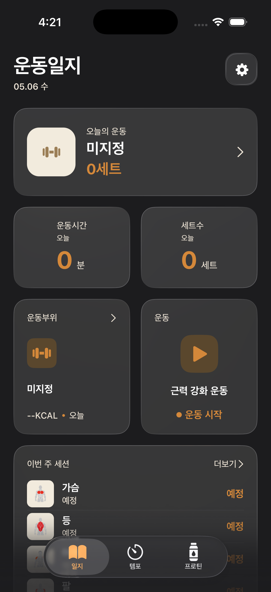
</p>

### 카운트다운

카운트다운 화면은 운동 시작 직후 사용자가 운동에 진입하기 전 짧은 준비 시간을 제공합니다. 큰 숫자와 원형 진행 표시를 통해 남은 시간을 직관적으로 보여주며, 운동 시작 액션과 실제 기록 화면 사이의 전환을 자연스럽게 연결합니다.

<p>
  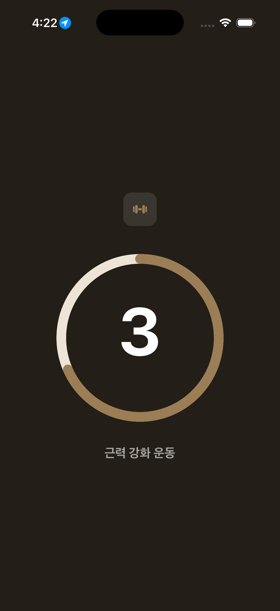
</p>

### 운동 중 화면

운동 중 화면에서는 사용자가 운동 부위와 세트 수를 조정하고, 메모를 작성하며 운동 기록을 남길 수 있습니다. 상단에는 활동 칼로리와 총 칼로리가 표시되고, 하단 고정 영역에는 운동 시간과 정지 버튼이 배치되어 있습니다.

유산소 클릭 전 화면은 근력 운동 기록 중심의 상태를 보여줍니다. 사용자는 가슴, 등, 어깨, 팔, 하체 등 루틴을 선택하고, 세부 운동 부위를 설정한 뒤 세트 수와 메모를 입력할 수 있습니다.

<p>
  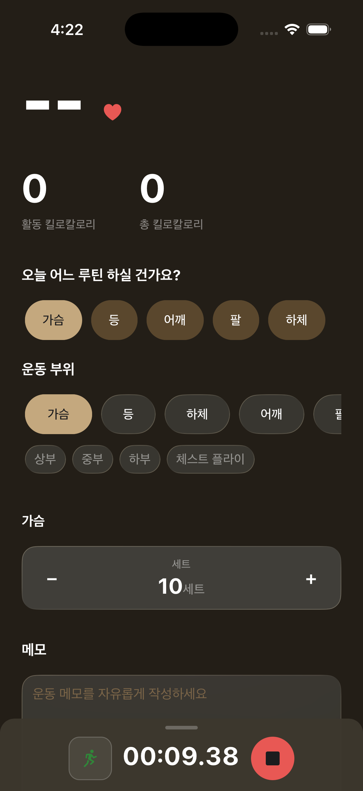
</p>

유산소 클릭 후 화면은 하단 유산소 아이콘이 활성화된 상태를 보여줍니다. 이를 통해 운동 중 화면이 단순 타이머가 아니라, 사용자가 선택한 운동 상태를 반영하는 기록 화면임을 보여줍니다.

<p>
  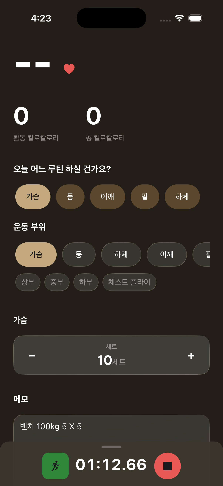
</p>

### 운동 결과 페이지

운동 결과 페이지는 두 가지 역할을 가집니다.

첫 번째는 운동을 마친 직후 결과를 확인하는 화면입니다. 사용자가 운동 중 화면 하단의 정지 버튼을 누르면 운동이 종료되고, 결과 페이지에서 운동 부위, 시간, 세트 수, 메모, 칼로리, 평균 심박수, 지도 정보를 확인할 수 있습니다.

두 번째는 저장된 운동 기록을 다시 열어보는 세션 상세 화면입니다. 사용자는 운동 종료 후 메인화면, 캘린더, 세션 리스트에서 완료된 운동 기록을 선택해 같은 결과 페이지로 다시 진입할 수 있습니다.

```text
운동 완료 직후:
운동 중 화면 → 하단 정지 버튼 → 운동 결과 페이지

메인화면에서 재조회:
운동 종료 후 메인화면 → 완료된 운동 카드 선택 → 운동 결과 페이지

캘린더에서 재조회:
캘린더 → 기록이 있는 날짜 선택 → 운동 기록 선택 → 운동 결과 페이지

세션 리스트에서 재조회:
세션 리스트 → 완료된 운동 세션 선택 → 운동 결과 페이지
```

<p>
  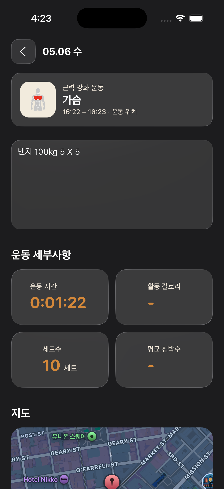
</p>

### 운동 종료 후 메인화면

운동 종료 후 메인화면은 운동 전 상태와 다르게 오늘 수행한 운동 기록이 반영된 상태를 보여줍니다. 오늘의 운동 카드에는 `가슴`과 `10세트`가 표시되고, 운동시간과 세트수 카드에도 오늘의 결과가 반영됩니다. 분할 루틴 영역에서도 완료된 운동이 목록으로 표시되어 사용자가 기록을 다시 확인할 수 있습니다.

<p>
  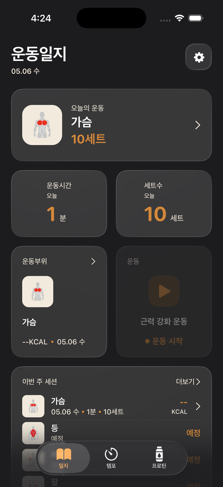
</p>

### 캘린더와 세션 리스트

캘린더는 날짜별 운동 기록을 확인하는 화면입니다. 기록이 있는 날짜에는 운동 부위 아이콘과 기록 수가 표시되어, 사용자가 어느 날 어떤 운동을 했는지 빠르게 확인할 수 있습니다.

<p>
  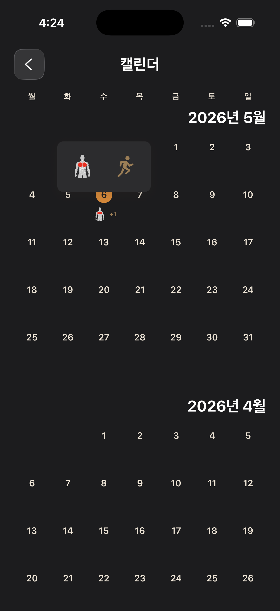
</p>

세션 리스트는 저장된 운동 세션을 목록으로 확인하는 화면입니다. 전체, 가슴, 등, 하체, 어깨 등 운동 부위별 필터를 통해 원하는 기록을 좁혀볼 수 있고, 특정 세션을 선택하면 운동 결과 페이지로 이동해 상세 기록을 확인할 수 있습니다.

<p>
  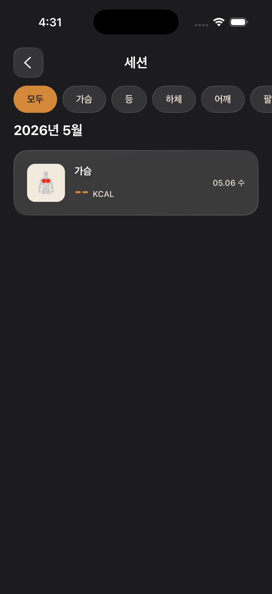
</p>

## 2. 프로틴

프로틴 페이지는 운동 기록 앱 안에서 영양 정보 탐색을 보조하는 영역입니다. 사용자는 프로틴 리스트에서 제품을 비교하고, 상세 페이지에서 현재가, g당 가격, 특징, 가격 추이를 확인할 수 있습니다.

프로틴 리스트 화면은 `전체`, `WPC`, `WPI`, `WPC/WPI` 등 카테고리 필터를 제공하고, 제품별 용량, 종류, 맛, 가격, g당 가격, 가격 평가 태그를 목록으로 보여줍니다. 이를 통해 사용자는 여러 제품을 빠르게 비교할 수 있습니다.

<p>
  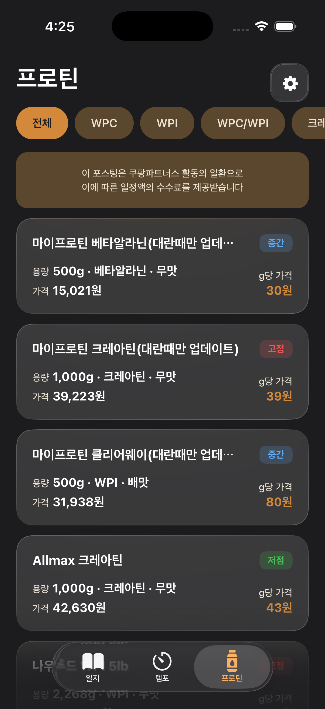
</p>

프로틴 상세 화면은 선택한 제품의 정보를 더 깊게 확인하는 화면입니다. 제품명, 용량, 종류, 맛, 가격 평가, 현재가, g당 가격, 특징, 가격 추이 그래프, 구매 이동 버튼을 제공해 사용자가 구매 전 정보를 검토할 수 있도록 구성되어 있습니다.

<p>
  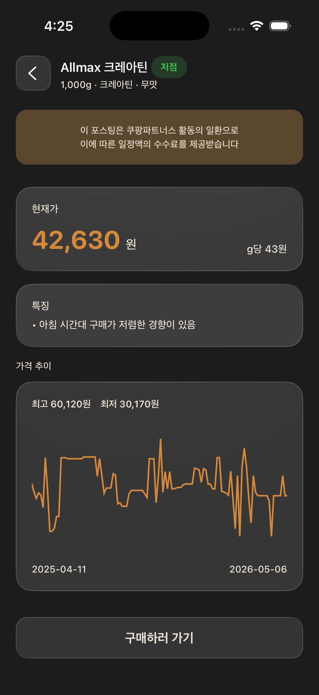
</p>

```text
프로틴 리스트
→ 제품 선택
→ 프로틴 상세
→ 가격과 특징 확인
→ 구매하러 가기
```

## 3. 템포

템포 페이지는 운동 수행 중 리듬과 페이스를 관리하는 보조 기능입니다. 화면에서는 `수축 먼저`, `이완 먼저` 모드를 선택할 수 있고, 수축 시간, 이완 시간, 횟수, 세트, 휴식 시간을 조절할 수 있습니다.

이 기능은 사용자가 반복 운동을 할 때 일정한 속도로 동작을 수행하도록 돕습니다. 운동일지가 결과 기록 중심이라면, 템포는 실제 운동 수행 과정의 품질을 높이는 도구입니다.

<p>
  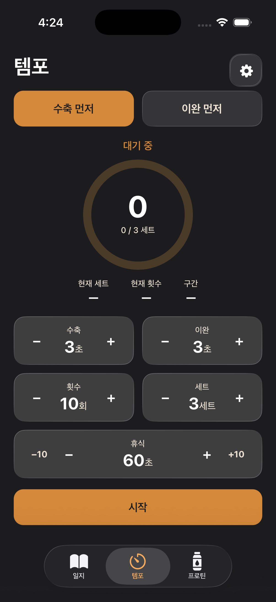
</p>

## 4. 설정

설정 화면은 앱 사용 환경을 개인화하는 영역입니다. 운동 섹션에서는 주간 루틴, 운동 리마인더, 운동 장소 도착 알림을 설정할 수 있고, 프로틴 섹션에서는 마이프로틴 세일 알림을 관리할 수 있습니다.

주간 루틴은 운동일지와 운동 중 화면에서 루틴 진행률과 추천 세션을 보여주는 기능과 연결됩니다. 운동 리마인더는 운동을 기록하지 않은 날 정해진 시간에 알림을 제공하고, 장소 도착 알림은 자주 운동한 장소 근처에서 운동 시작을 제안하는 방식으로 사용자의 운동 습관 형성을 보조합니다.

<p>
  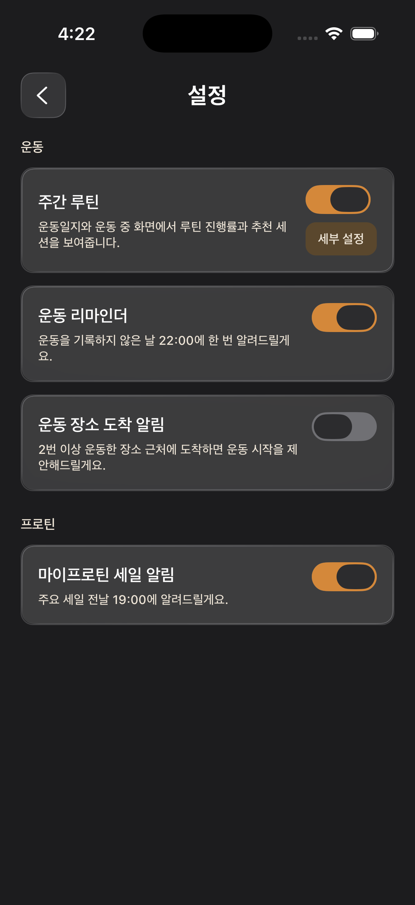
</p>

## UX 설계 포인트

### 1. 운동 기록을 하나의 연속된 흐름으로 구성

운동 전 메인화면, 카운트다운, 운동 중 화면, 결과 페이지, 기록 재조회 화면이 분리되어 있지만 사용자는 하나의 흐름으로 경험합니다. YepBuddy는 운동 시작부터 완료 후 확인까지 이어지는 과정을 단계적으로 보여주어 사용자가 현재 상태와 다음 행동을 쉽게 이해할 수 있게 설계되어 있습니다.

### 2. 결과 페이지를 재사용 가능한 상세 화면으로 구성

운동 결과 페이지는 운동 직후에만 등장하는 화면이 아니라 저장된 운동 세션의 상세 페이지로도 사용됩니다. 이 구조는 같은 기록을 메인화면, 캘린더, 세션 리스트에서 다시 열어볼 수 있게 하며, 기록 관리 기능의 일관성을 높입니다.

### 3. 메인화면에서 운동 전후 상태를 명확히 구분

운동 전에는 오늘의 운동이 미지정 상태로 표시되고, 운동 후에는 운동 부위, 운동시간, 세트 수, 분할 루틴 기록이 반영됩니다. 사용자는 메인화면만 봐도 오늘 운동을 했는지, 어떤 기록이 저장되었는지 빠르게 확인할 수 있습니다.

### 4. 운동 보조 기능을 탭 구조 안에 통합

프로틴과 템포는 운동일지와 직접 같은 흐름에 있지는 않지만, 운동 생활을 보조하는 기능으로 함께 배치되어 있습니다. 프로틴은 운동 후 영양 정보 탐색을 돕고, 템포는 운동 중 동작 리듬을 관리합니다.

## 포트폴리오용 소개 문구

YepBuddy는 운동 시작부터 기록, 결과 확인, 기록 재조회까지 이어지는 사용자 흐름을 중심으로 설계한 모바일 운동 기록 앱입니다. 사용자는 운동 전 메인화면에서 오늘의 상태를 확인하고, 카운트다운을 거쳐 운동을 시작하며, 운동 중 세트 수와 메모를 기록할 수 있습니다. 운동 완료 후에는 결과 페이지에서 수행한 운동을 확인하고, 이후 캘린더와 세션 리스트에서 저장된 기록을 다시 조회할 수 있습니다.

프로젝트에서 강조할 수 있는 부분은 운동 결과 페이지의 역할 설계입니다. 이 화면은 운동 직후 결과 확인 화면이면서 동시에 저장된 세션의 상세 조회 화면으로 사용되며, 메인화면, 캘린더, 세션 리스트에서 동일한 기록으로 접근할 수 있습니다. 이를 통해 YepBuddy는 운동 기록이 단절되지 않고 누적되는 경험을 제공합니다.

## 기여 내용 템플릿

- 운동 시작부터 결과 확인, 기록 재조회까지 이어지는 핵심 사용자 흐름을 설계하고 구현했습니다.
- 운동 결과 페이지를 완료 직후 확인 화면이자 저장된 세션 상세 화면으로 활용할 수 있도록 화면 관계를 구성했습니다.
- 운동 전후 메인화면의 상태 차이를 명확히 설계해 사용자가 오늘의 운동 기록을 빠르게 확인할 수 있도록 했습니다.
- 캘린더와 세션 리스트를 통해 날짜별, 부위별 운동 기록을 다시 확인할 수 있는 구조를 설계했습니다.
- 프로틴 리스트와 상세 페이지를 구성해 운동 기록 앱 안에서 영양 정보 탐색 경험을 함께 제공했습니다.
- 수축, 이완, 횟수, 세트, 휴식 시간을 조절하는 템포 기능을 통해 운동 수행 과정의 페이스 관리를 지원했습니다.

## 화면별 캡션

| 이미지 | 캡션 |
| --- | --- |
| 01_운동일지_메인_운동전.png | 운동 전 오늘의 상태와 운동 시작 진입점을 제공하는 메인화면 |
| 02_운동일지_카운트다운.png | 운동 시작 전 사용자가 준비할 수 있도록 돕는 카운트다운 화면 |
| 03_운동일지_운동중_유산소_클릭전.png | 운동 부위, 세트 수, 메모를 기록하는 운동 중 화면 |
| 04_운동일지_운동중_유산소_클릭후.png | 유산소 상태가 선택된 운동 중 기록 화면 |
| 05_운동일지_운동결과.png | 완료한 운동 결과와 저장된 세션 상세 정보를 확인하는 화면 |
| 06_운동일지_메인_운동종료후.png | 오늘의 운동 기록이 반영된 운동 종료 후 메인화면 |
| 07_운동일지_캘린더.png | 날짜별 운동 기록을 확인하는 캘린더 화면 |
| 08_운동일지_세션리스트.png | 저장된 운동 세션을 부위별로 조회하는 세션 리스트 화면 |
| 09_프로틴_리스트.png | 프로틴 제품을 카테고리별로 탐색하고 비교하는 리스트 화면 |
| 10_프로틴_상세.png | 선택한 프로틴 제품의 가격과 특징, 가격 추이를 확인하는 상세 화면 |
| 11_설정.png | 운동 루틴, 리마인더, 장소 알림, 프로틴 세일 알림을 관리하는 설정 화면 |
| 12_템포.png | 수축, 이완, 횟수, 세트, 휴식 시간을 조절하는 템포 화면 |

## 최종 요약

YepBuddy는 운동을 시작하고 기록하는 순간부터 완료된 운동을 다시 확인하는 과정까지 자연스럽게 연결하는 모바일 운동 기록 앱입니다. 운동일지를 중심으로 운동 전후 상태를 명확히 보여주고, 운동 결과 페이지를 통해 완료 직후와 기록 재조회 경험을 함께 제공합니다. 여기에 프로틴 정보 탐색과 템포 기능을 더해 운동 기록뿐 아니라 운동 생활 전반을 보조하는 구조를 갖추고 있습니다.
