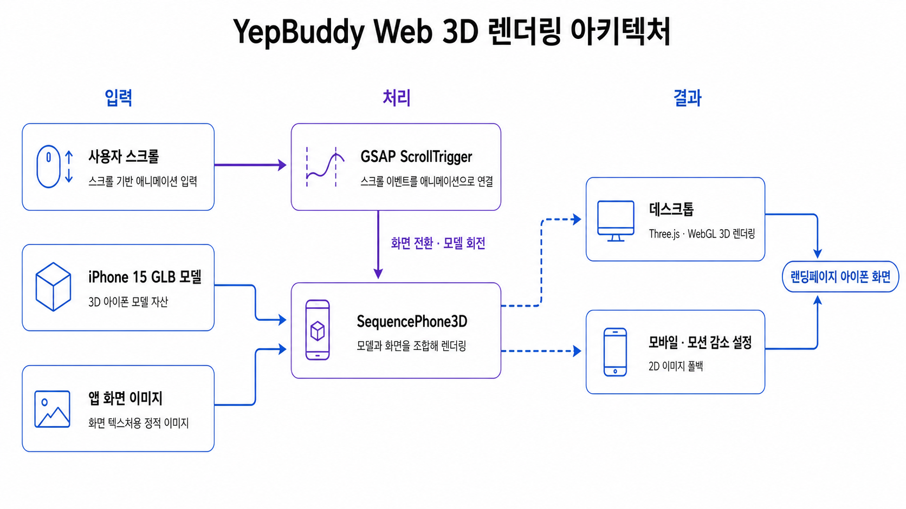

# YepBuddy Web

YepBuddy의 운동 기록 흐름과 주요 기능을 소개하고 App Store·Google Play 다운로드로 연결하는 서비스 랜딩페이지입니다.

[서비스 바로가기](https://yepbuddy.netlify.app/)

## 3D 렌더링 아키텍처

데스크톱에서는 넓은 화면을 활용해 스크롤에 따른 3D 화면 전환과 모델 회전을 제공합니다. 모바일과 모션 감소 설정 환경에서는 렌더링 부하를 줄이고 안정적인 탐색과 접근성을 확보하기 위해 2D 이미지로 전환합니다.

---

3D 모델: *Apple iPhone 15 Pro Max Black* by Polyman_3D ([CC BY 4.0](https://creativecommons.org/licenses/by/4.0/)).
