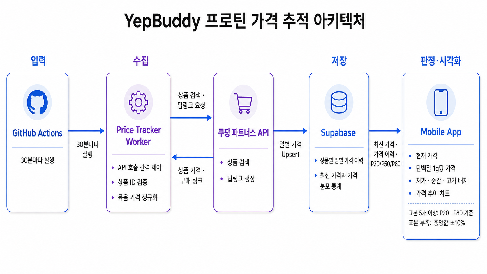

# YepBuddy Worker

쿠팡 파트너스 상품 가격을 주기적으로 확인해 Supabase에 일별 이력으로 저장하고, 모바일 앱의 가격대 판정과 가격 추이 그래프로 연결하는 워커입니다.

## 전체 아키텍처



---

## 핵심 구현

### 가격 이력을 구매 판단 정보로 전환한 프로틴 가격 추적

> 상품별 가격을 일별 이력으로 축적하고 현재가를 해당 상품의 과거 가격과 비교해 상대적인 가격 수준을 제공합니다.

#### 문제

현재 가격만으로는 평소보다 저렴한지 판단하기 어렵고, 상품마다 가격대가 달라 하나의 고정 금액을 공통 기준으로 사용할 수도 없었습니다.

#### 핵심 선택

GitHub Actions로 가격 조회를 30분 간격으로 예약하고, 검색 결과에서는 미리 지정한 상품과 일치하는 값만 선택했습니다. 현재 가격은 자주 갱신하되 가격 이력은 일 단위로 유지하기 위해 같은 날짜의 데이터는 새로운 행을 추가하지 않고 최신 값으로 갱신했습니다.

```js
await supabase
  .from("protein_prices_daily")
  .upsert([insertData], {
    onConflict: "protein_id,observed_date",
    ignoreDuplicates: false,
  })
```

워커는 가격을 수집하고 저장하는 역할만 담당합니다. 모바일 앱은 조회한 가격 통계로 현재 가격대를 판정합니다. 표본이 충분하면 과거 가격의 하위 20%와 상위 20% 경계값을 사용하고, 표본이 부족하면 중앙 가격 대비 10% 범위를 임시 기준으로 사용합니다.

```ts
if (
  p20 != null &&
  p50 != null &&
  p80 != null &&
  Number.isFinite(p20) &&
  Number.isFinite(p50) &&
  Number.isFinite(p80) &&
  sampleCount >= 5
) {
  if (price <= p20) return { kind: "low", color: "green", reason: "P20 이하" }
  if (price >= p80) return { kind: "high", color: "red", reason: "P80 이상" }
  return { kind: "mid", color: "blue", reason: "중간 구간" }
}

if (p50 != null && Number.isFinite(p50) && p50 > 0) {
  if (price <= p50 * 0.9) {
    return { kind: "low", color: "green", reason: "중앙값-10% 이하" }
  }
  if (price >= p50 * 1.1) {
    return { kind: "high", color: "red", reason: "중앙값+10% 이상" }
  }
  return { kind: "mid", color: "blue", reason: "중앙값±10%" }
}
```

목록에서는 저점, 중간, 고점 배지로 현재 가격 수준을 빠르게 비교하고, 상세 화면에서는 조회된 가격 이력의 최고가와 최저가 및 추이 그래프로 가격 변화의 맥락을 제공합니다.

#### 결과

- 30분 간격으로 현재 가격을 확인하고 상품별 일별 가격 이력 축적
- 같은 날짜의 중복 행 없이 현재 가격을 최신 값으로 갱신
- 상품별 과거 가격을 기준으로 상대적인 가격대 제공
- 목록 배지와 상세 가격 추이 그래프로 구매 판단 지원

#### 현재 한계

- 가격대 기준은 사용자 행동으로 검증된 절대 기준이 아닌 초기 제품 가설
- 같은 날의 중간 가격은 덮어쓰므로 일중 가격 변화는 보존하지 않음
- 차트는 관측 순서를 사용하므로 누락된 날짜 사이의 실제 시간 간격을 표현하지 않음
